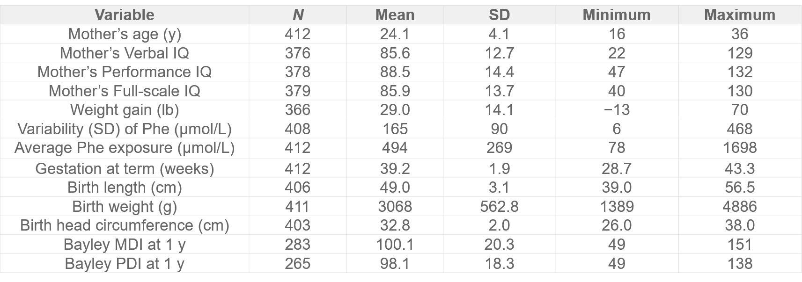

```{r setup, include=FALSE}
knitr::opts_chunk$set(echo = TRUE)
```

## Background  
  
The genetic disorder phenylketonuria (PKU) is the inability to metabolize phenylalanine because of a lack of the enzyme phenylalanine(Phe) hydroxylase. Individuals with this disorder are known as "phenylketonurics" and must regulate their intake of phenylalanine, an essential amino acid that support our body to remain healthy. The paper that this project based on is: ([paper](data_sim.pdf))    
```  
Relation of Prenatal Phenylalanine Exposure to Infant and Childhood Cognitive Outcomes:  
         Results From the International Maternal PKU Collaborative Study  
                           Widaman, K. & Azen, C. (2003).  
                     Pediatrics, 112(Supplement 4), 1537-1543  
 Retrieved from http://pediatrics.aappublications.org/content/112/Supplement_4/1537.
```   
It studied 412 children and their mothers from the International Maternal PKU Collaborative Study on their prenatal Phe exposure to the effect on offstrings intellectual development.  

The goal of this project is to simulate the data and replicate the study on relation of prenatal Phenylalanine exposure to infant and childhood cognitive outcomes. In addition, developmental relations of maternal demographic, pregnancy-related, and prenatal variables on offspring intelligence will also be examined.  
  
  
## Methods
  
### Software and Packages 
`R` is used for all procedures related to data.  
Packages used:
```{r}
library(dplyr)
library(reshape2)
library(ggplot2)
```
  
### Data Simulation  
Based on the given summary sttistics below on the variables, their distributions will be estimated. In addition, linear combination formulas will be constructed for variables that are obviously related to others (i.g. birth weight is related to mother's weight gain and baby's head circumference).  
  
   
  
The data simulation function is presented below:  
```{r}
generateData = function(N=412){
  #Random generated variables: 
  age = sample(c(runif(412,16,36)),N,replace = T) 
  mVIQ = sample(c(abs(105-rweibull(376,2, 45))+22, rep(NA,(412-376))),N,replace = T)
  mPIQ = sample(c(rnorm(378, 88.5,14.4), rep(NA,(412-378))),N,replace = T)
  mIQ = sample(c((mVIQ+mPIQ)/2), N,replace = T)
  gestation = sample(c(45-rweibull(412,1.6,5)),N,replace = T)
  phe_sd = sample(c(rweibull(408,2,188),rep(NA,(412-408))),N, replace = T)
  phe_avg = sample(c(rweibull(412,1.8,610)),N,replace = T)
  # *Missing values are generated as NA proportionally to the real data.  
  
  # Formulated variables based on related variables:
  wt_gain= sample(c(rnorm(366,25.0,14.1),rep(NA,(412-366))),N,replace = T)+0.1*gestation
  birth_len = sample(c(rnorm(406,45.0,3.1),rep(NA,(412-406))),N,replace = T)+0.1*gestation
  head_circum = sample(c(rnorm(403,32.8,2.0),rep(NA,(412-403))),N, replace = T)+0.1*gestation-0.001*phe_avg-2  
  birth_wt = 38*gestation+7*head_circum+41*wt_gain
  MDI = 1.5*head_circum+3*gestation-0.012*phe_avg-56.5
  PDI = 1.5*head_circum+2.5*gestation-0.022*phe_avg-40.5
  
  # Compose into data frame:
  result = data.frame(age, mVIQ, mPIQ, mIQ, wt_gain, phe_sd,
                      phe_avg, gestation, birth_len, birth_wt,
                      head_circum, MDI, PDI)
  return(result)
}
```
  
Users could generate any number of observations by calling:  
```{r}
data = generateData(1000)
summary(data)
```  

### Data Anaysis   
Predictor variables:  
  - Mother's age (y)  
  - Mother's Verbal IQ  
  - Mother's Performance IQ  
  - Mother's Full-scale IQ  
  - Weight gain (lb)  
  - Variability (SD) of Phe (umol/L)  
  - Average Phe exposure (umol/L)  
  - Gestation at term(weeks)  
  
Response variables:  
  - Birth length (cm)  
  - Birth weight (g)  
  - Birth head circumference (cm)  
  - Bayley (Mental Development Index) MDI at age 1  
  - Bayley (Psychomotor Development Index) PDI at age 1  
  
Linear regression models will be constructed to detect relationships.  
  
```{r}
b = melt(data)
ggplot(b,aes(x = value)) + 
  facet_wrap(~variable,scales = "free")+
  geom_histogram(fill="pink",bins = 50)
cor(na.omit(data))
data = mutate(data, age.level=factor(ifelse(data$age<20, "teens", ifelse(data$age<25,"early.20s",ifelse(data$age<30,"late.20s",ifelse(data$age<35,"early.30s","late.30s")))),levels = c("teens", "early.20s","late.20s", "early.30s", "late.30s"), ordered = T
)) 
ggplot(data=data, aes(x=phe_avg, y = MDI))+geom_point(aes(color = age.level))+
  geom_smooth(data=data, aes(x=phe_avg,y=MDI),method = "lm", se = F)
```
  
## Results  
   
### Analysis on influential factors of children's cognitive performance  
```{r}
lm1 = lm(MDI ~ phe_avg, data =data)  
summary(lm1)   
plot(lm1,1)   
```   

* Average maternal Phe exposure is a significant preditor of children's MDI at age 1.    
  
```{r}
lm2 = lm(PDI ~ phe_avg, data =data)  
summary(lm2)  
plot(lm2,1)  
```  

* Average maternal Phe exposure is a significant preditor of children's PDI at age 1.    
  
When consider full model to observe other signficant variables:    
```{r}
full1 = lm(MDI ~ . -PDI-age.level , data =data)  
summary(full1)  
plot(full1,1)   
```  

* Mother's Performance IQ, mother's weight gain during pregnancy, average maternal Phe exposure, gestation term, and baby's weight at birth are significant predictor's of the baby's cognitive performance.   
  
### Additional analysis on influential factors on newborn condition  
```{r}
bwt_all = lm(birth_wt ~ . -MDI -PDI -age.level, data = data)  
summary(bwt_all)  
plot(bwt_all,1)  
```   

* Mother's Performance IQ, mother's weight gain during pregnancy, gestation term, and baby's head circumfernce at birth are significant predictor's of the baby's birth weight.  
  
```{r}
hcir_all = lm(head_circum ~ . -MDI -PDI -age.level, data = data)  
summary(hcir_all)  
plot(hcir_all,1)  
```   

* Mother's Performance IQ, mother's weight gain during pregnancy, gestation term, and baby's weight at birth are significant predictor's of the baby's head circumference at birth.  
  
  
## Conclusion  
  
**This project has sucessfully simulated the study data with its characteristics and replicated the study result. Baby's cognitive performance is negatively affected by maternal Phe exposure.**  